# DUNS 번호 발행 방법

## 던스 번호(D-U-N-S Number)란?

D-U-N-S Number(The Data Universal Numbering System)는 "국제사업자등록번호"로 통용되는, 전 세계 표준 기업식별코드로 9자리의 숫자로 구성됩니다.

사업자등록체계가 잘 갖춰진 대한민국과는 달리, 사업자등록체계가 없는 국가도 존재합니다. 사업자등록체계가 있다 해도 국가별로 상이한 사업자 식별 코드로 인한 관리의 어려움이 크므로, 이를 해결하기 위해 D&B가 개발하여 전 세계가 사용하는 기업식별코드입니다.

일반적으로 외국계 기업에서는 DUNS 넘버를 많이 이용하고 있으며, 애플 개발자 등록 시 필요하고 구글에서도 조직 개발자들에게 DUNS 넘버를 요구하고 있습니다.

따라서 **애플, 구글 개발자 계정을 등록할 때 D-U-N-S Number를 필수 발급받아야 합니다.**

> **안내**: 아래에서 안내하는 DUNS 번호 발행 방법은 애플 및 구글 개발자 계정 생성 시에만 이용 가능합니다. 개발자 계정 생성 외에는 다른 용도로 이용이 불가합니다. 해외 무역, 해외 계약, 글로벌 기업 인증 코드 등록 등 글로벌 비즈니스 용도로 이용하려면 별도로 비용을 내고 발행받아야 합니다.

---

## DUNS 번호 무료 발행 절차

### 1단계: 사이트 접속 및 이메일 주소 입력

Dun & Bradstreet [D&B 지원 사이트](https://support.dnb.com/?CUST=APPLEDEV)에 접속합니다.

> **주의**: 모든 내용은 영어로 입력해주세요!

이메일 주소를 입력합니다. 가입 및 DUNS 넘버 등록 완료 등 소식을 받을 이메일입니다.

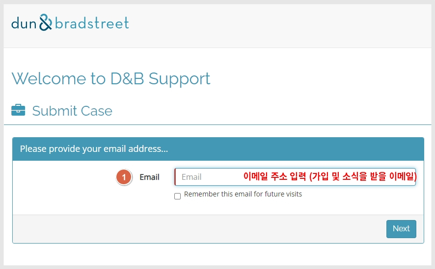

### 2단계: 가입자 기본정보 입력

가입자의 기본정보를 입력합니다. 사업체의 정보를 바탕으로 입력해야 하며, 모든 내용은 영어로 입력해야 합니다.

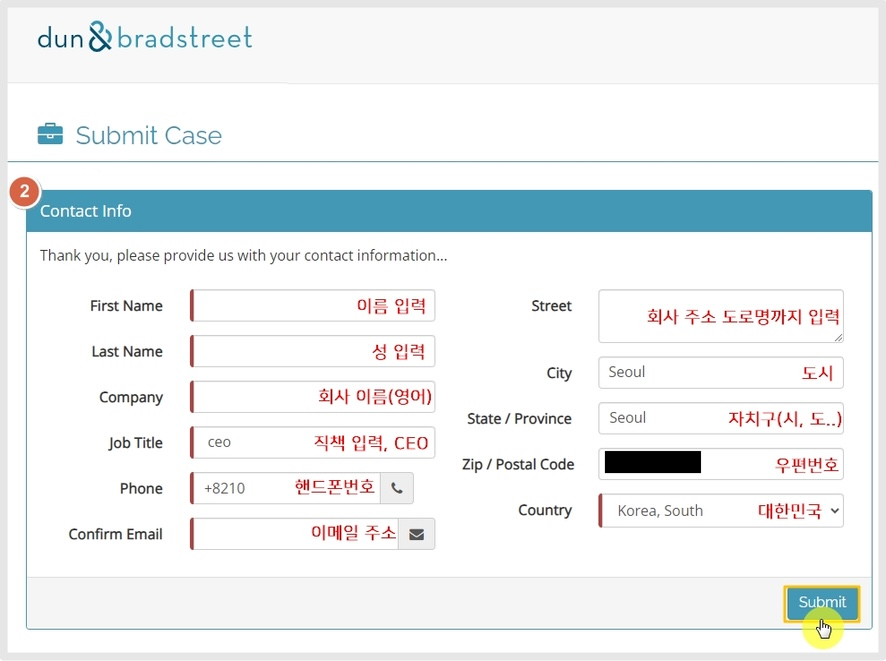

| 항목 | 설명 |
|------|------|
| 1) 이름/성 | 회사 대표자 이름, 성 입력 (영어) |
| 2) 회사 이름 | 회사명을 영어로 입력 |
| 3) 직책 | CEO로 입력 |
| 4) 핸드폰 번호 | 국가번호 +82 포함하여 입력 (예: +821012345678) |
| 5) 이메일 주소 | 대표자 혹은 가입자 본인 이메일 |
| 6) 회사 주소 | 도로명까지 영어로 입력 |
| 7) 도시 | 서울, 인천, 부산 등 |
| 8) 자치구 | 서울, 경기도, 제주도, 부산 등 |
| 9) 우편번호 | 우편번호 입력 |
| 10) 국가 | Korea, South 선택 |

> **주의**: 회사명을 기재할 때는 반드시 사업자등록증에 등록된 회사 이름을 영어로 직역하여 등록해야 합니다. 구글 및 애플 계정 등록 시 계정에 등록된 사업자명, 사업자등록증에 기재된 사업자명, DUNS에 등록된 사업자명 3개 정보가 모두 일치해야 합니다. 사업자등록증에 기재된 명칭과 다른 이름으로 등록할 경우 번호는 발행될 수 있으나, 애플이나 구글 개발자 계정 가입 시 조직명이 일치하지 않는다는 이유로 가입이 안 되는 상황이 발생할 수 있습니다.

입력 완료되면 **[Submit]** 제출 버튼을 선택합니다.

### 3단계: Developer Program 선택

Developer Program을 선택합니다.

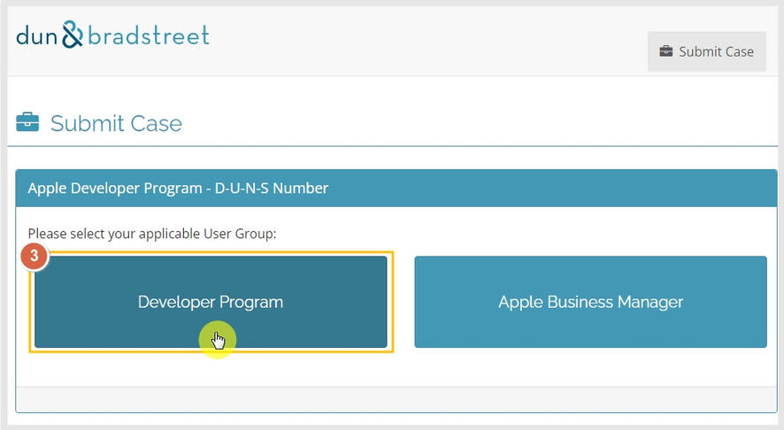

### 4단계: Create New DUNS 선택

Create New DUNS를 선택합니다.

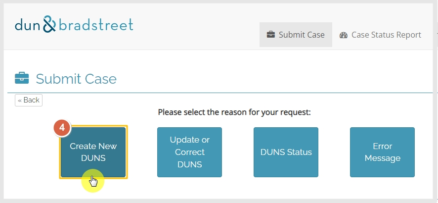

### 5단계: Country 선택

Country에서 비즈니스 국가를 선택하고 'Next'를 클릭합니다.

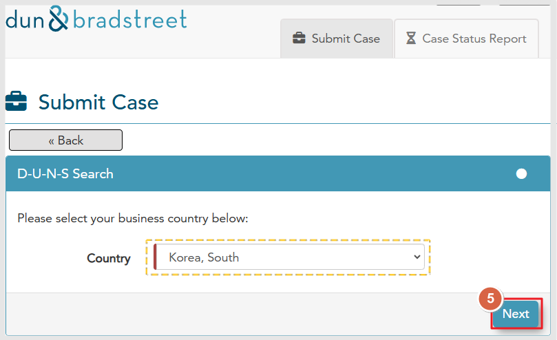

### 6단계: DUNS Search

영문 사업자등록증에 기재된 영문 법인명 및 회사가 위치한 도시의 영문을 입력하고 'Lookup by Name / Address'를 클릭합니다.

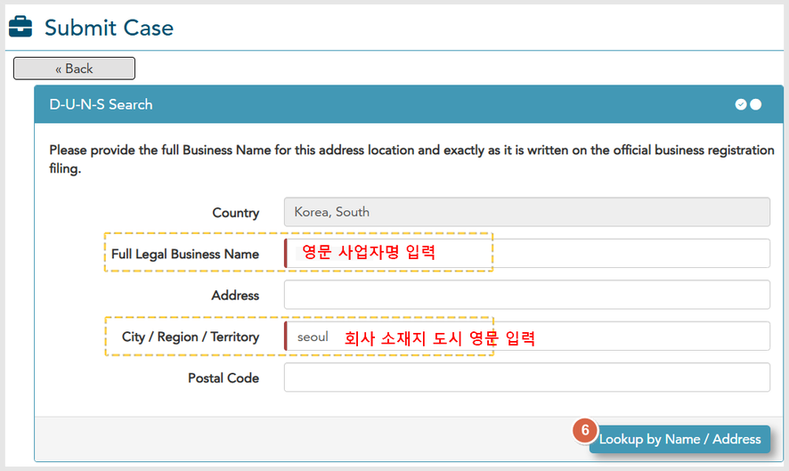

**D-U-N-S Search 입력 항목:**
- **Full Legal Business Name**: 영문 사업자등록증에 기재된 영문 법인명 입력
- **City / Region / Territory**: 회사가 위치한 도시의 영문 입력 (예: Seoul)

### 7단계: 'Click here' 선택

일반적으로 처음 DUNS 번호를 만드는 것이기 때문에, 조회되는 정보가 없을 것입니다. 따라서 상단에 **'click here'** 를 클릭해주세요. 해당 버튼을 누르면 본격적인 사업자 등록 화면으로 이동합니다.

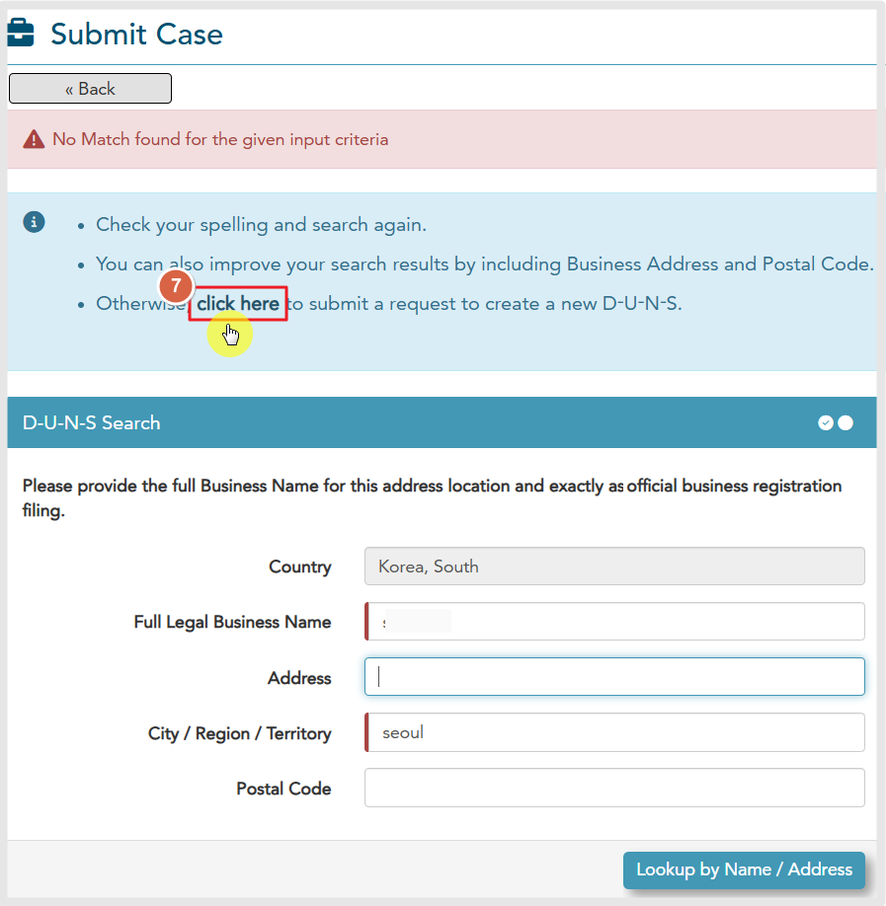

### 8단계: 회사 상세 정보 입력

사업자 정보를 입력하는 단계입니다.

> **참고**: 빨간색으로 표시된 부분만 필수 항목이므로, 해당 영역만 입력해도 됩니다. 모든 답변은 영어로 입력해야 합니다.

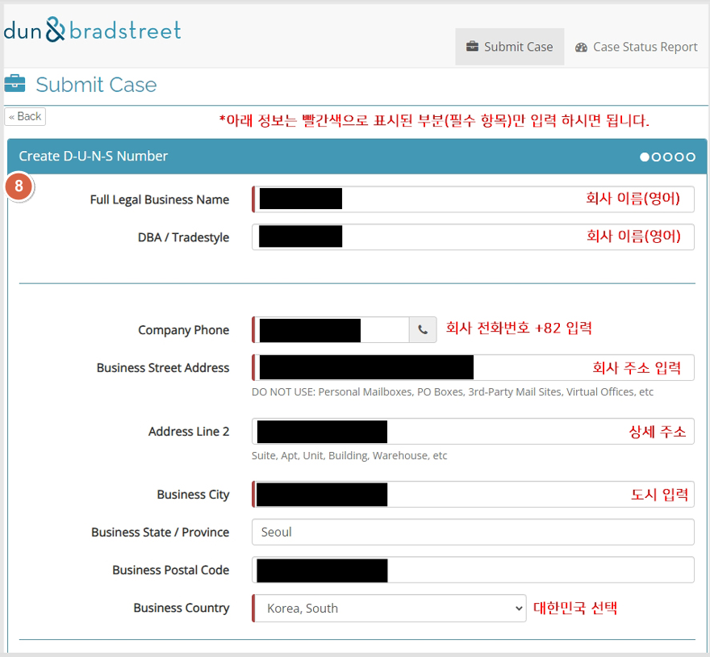

| 항목 | 설명 |
|------|------|
| 1) 회사 이름 | 사업자등록증에 등록된 회사 이름을 영어로 직역하여 입력 |
| 2) 회사 전화번호 | 국가번호 +82 기재 (회사번호가 없으면 핸드폰번호 가능) |
| 3) 회사 주소 | 상세 주소는 선택사항 |
| 4) 도시 | Seoul, Busan, Daegu 등 |
| 5) 국가 | 대한민국 선택 |
| 6) 사업체 구분 | 법인: Corporate entity or Corporation / 개인: Sole proprietor or Single Person Business |
| 7) Home-Based Business? | 사업체가 자택이 아니면 "NO", 자택이면 "Yes" 선택 |

> **주의**: 회사명은 반드시 사업자등록증에 등록된 회사 이름을 영어로 직역하여 등록해야 합니다. 구글 및 애플 계정 등록 시 계정에 등록된 사업자명, 사업자등록증에 기재된 사업자명, DUNS에 등록된 사업자명 3개 정보가 모두 일치해야 합니다.

그 외 정보는 선택사항이므로 입력하지 않아도 가입이 가능합니다. 홈페이지 URL 입력, 사업체 근무인원 수, 개업일 등 입력 가능한 내용이 있을 경우 함께 입력해도 됩니다.

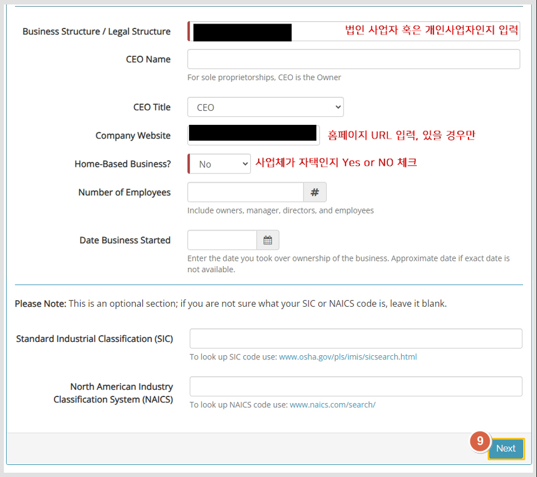

모든 내용 입력 후 **Next** 버튼을 선택합니다.

### 9단계: 사업자등록증 제출

**[파일 선택]** 을 선택하여 사업자등록증을 등록합니다.

추가 입력할 내용이 있다면 기재해도 되고(선택), 사업자등록증 파일만 제출해도 됩니다.

**[Submit]** 제출 버튼을 선택합니다.

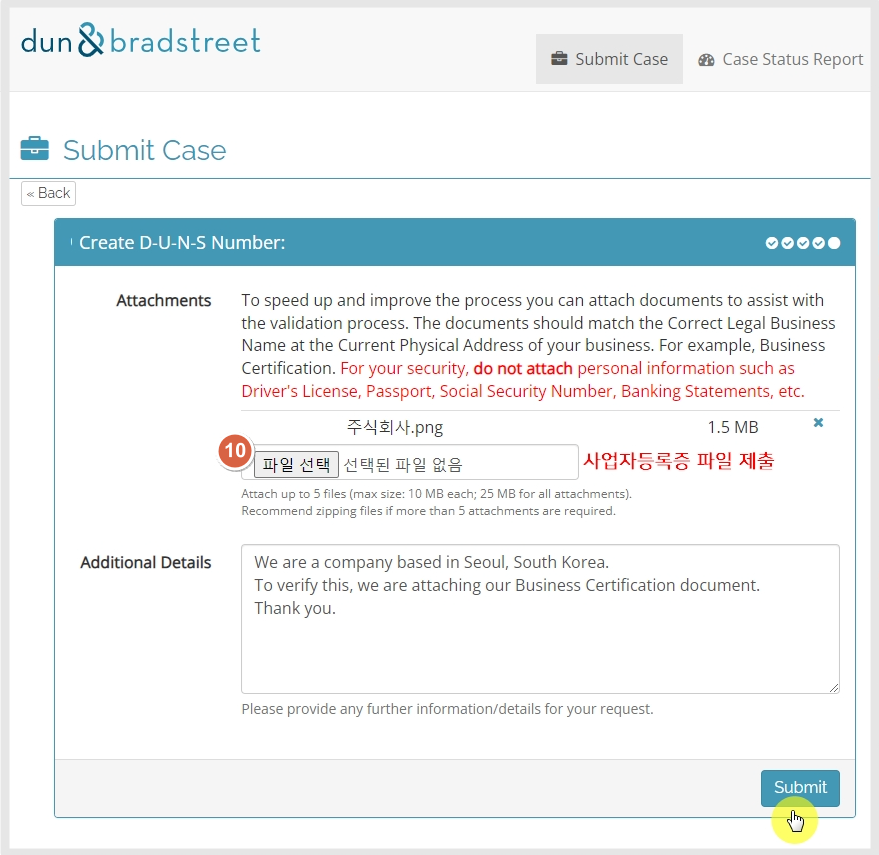

### 10단계: 발행 확인

발급이 완료되면 메일로 전송됩니다. 메일 본문에 던스 넘버 9자리를 확인할 수 있으며, 기업 이름도 잘 등록되었는지 확인할 수 있습니다.

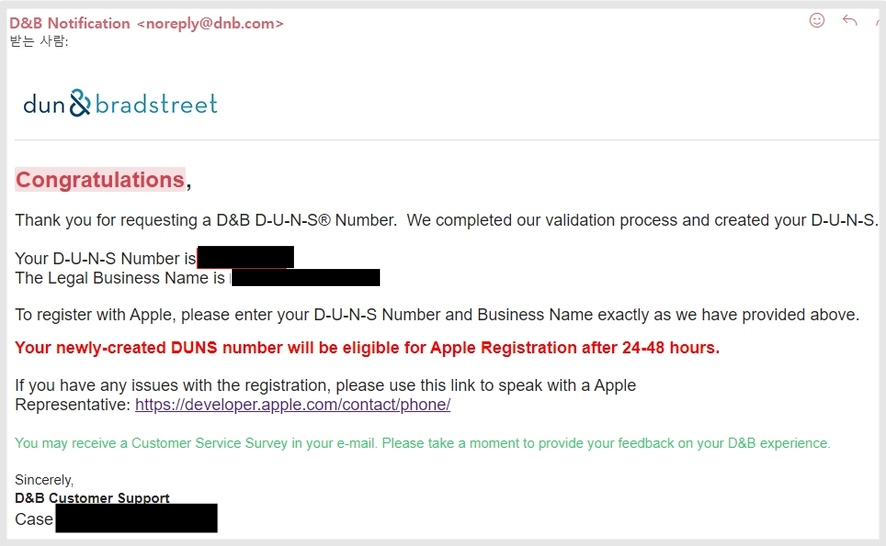

> **주의**: 번호가 발급되어도 번호 유효 시간이 존재합니다. 구글 및 애플에 번호를 반영하기까지 시간이 소요됩니다. **2~3일이 지난 후** 애플 개발자 계정이나 구글 개발자 계정을 등록해주시기 바랍니다.

> **주의**: 여기서 발행하는 DUNS 번호는 개발자 계정 생성 시에만 이용 가능합니다. 다른 목적으로는 이용 불가하며, 국제 무역이나 거래를 위한 인증서로 사용할 수 없습니다.

---

## TIP: 영어 페이지를 한국어로 번역하기

영어로 보기가 힘들다면 한국어로 번역하여 확인할 수 있습니다.

1. 웹 브라우저는 **크롬(Chrome)** 에서 이용
2. 화면에 마우스 커서를 두고, **오른쪽 버튼**을 선택
3. **한국어 번역**을 선택

한국어로 번역된 페이지로 확인할 수 있습니다.
