# 구글 개발자 - 조직(비즈니스) 계정 만들기 가이드

> 출처: [스윙투앱 가이드](https://documentation.swing2app.co.kr/knowledgebase/playstore/google-businessdeveloper)

---

## 개요

구글 개발자 조직 계정은 조직(회사)에서 만들 수 있는 계정으로, 회사 이메일주소를 구글 개발자 계정으로 연동할 수 있습니다.

### 구글 개발자 계정이란?

- 플레이스토어에 앱을 출시하기 위해 필요한 **개발자용 계정**
- 구글에 등록비를 내고 만들 수 있음
- **계정 등록비**: 25달러 (한번 결제 시 평생 이용, 한국 원화로 약 35,000~37,000원)
- **구글 플레이 개발자 콘솔**: https://play.google.com/console/developers
- 일반 지메일 계정만으로는 개발자 계정이 되지 않으며, 구글 콘솔에서 25달러 등록수수료를 결제한 계정이 개발자 계정이 됨

---

## 개발자 조직 계정 등록에 필요한 조건

### 1. 회사 홈페이지 필수

- 조직 계정 등록 시 **'조직 웹사이트 인증'** 항목이 추가됨 (2024년 4월 추가)
- 회사 홈페이지(웹사이트)가 없으면 조직 계정 등록 불가

### 2. DUNS 넘버 필수

- 조직 개발자 계정을 만들기 전에 **DUNS 넘버를 먼저 등록**해야 함
- 발행일이 4~5일 소요될 수 있으므로 계정 등록 전 먼저 진행 필요

---

## 구글 개발자 계정 등록 전 확인사항

1. Google Play 개발자 계정을 만들려면 **만 18세 이상**이어야 함
2. 이메일 주소 인증, 핸드폰 번호 인증 등 여러 차례 인증을 거침
3. 본인 인증이 가능해야 하며, 유효한 국가 발급 신분증과 신용카드가 모두 요구될 수 있음
4. **등록비 25달러**가 필요하며 신용 또는 체크카드로만 결제 가능
5. 본인 인증이 되지 않거나 잘못된 정보 제공 시 등록 수수료가 환불되지 않음
6. **해외결제 가능한** 신용카드 또는 체크카드로만 결제 가능

---

## ⚠️ 중요 안내사항 (2025년 10월 정책 변경)

### 개인 사업자의 계정 유형 선택

| 앱 유형 | 권장 계정 유형 |
|---------|--------------|
| **무료앱만 운영** | '조직' 개발자 계정으로 가입 가능 |
| **유료앱 판매 또는 수익 창출** | '개인' 개발자 계정으로 등록해야 함 |

> **이유**: 개인사업자는 조직 유형으로 수익을 받을 수 없음. 결제프로필 생성 불가능.

### 수익 창출 시 주의사항

- 앱에서 수익을 창출하려면 **'개인' 개발자 계정**으로 만들어야 함
- 개발자 계정과 판매자 계정 결제 프로필 유형이 **일치**해야 함
- 개인사업자인데 앱으로 수익을 창출한다면 → '개인' 개발자 계정으로 만들고, 판매자 계정-결제 프로필도 개인 유형으로 생성

---

## STEP 1. 구글 계정 만들기

구글 계정은 https://accounts.google.com/ 에서 새로 만들 수 있습니다.

### 개인 계정 사용 여부

- 사용 중인 개인 계정(지메일)으로 개발자 계정을 만들어도 됨
- 조직용 계정은 다른 직원들이 함께 공유하거나 회사 내에서 이용할 수 있으므로 **기업(업체)용으로 새로 계정을 만드는 것을 권장**

### 계정 만들기 단계

> 계정 만들기 → **"개인용"으로 선택**하고 진행

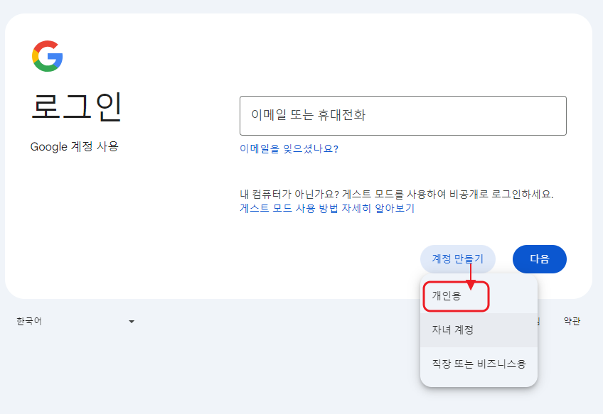

**1) 성, 이름 입력 후 [다음] 선택**

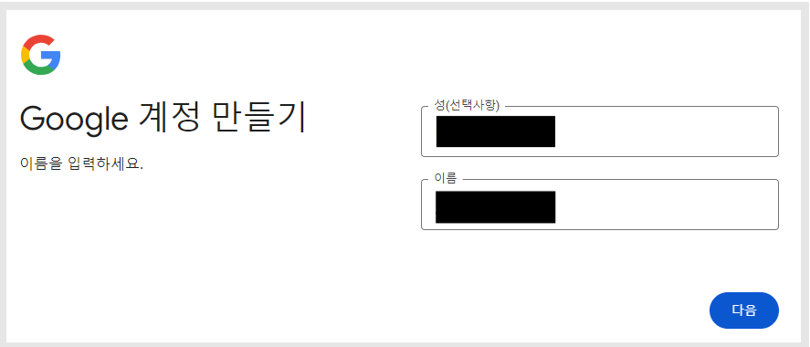

**2) 생년월일, 성별 입력 후 [다음] 선택**

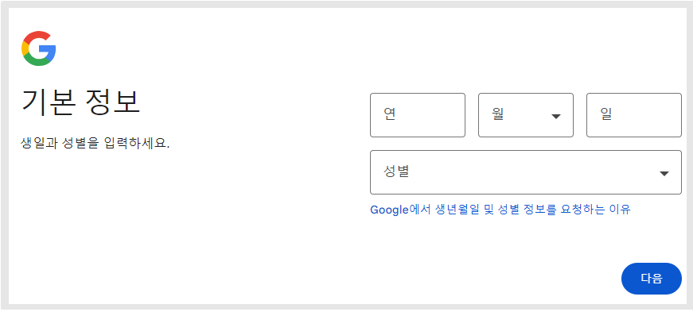

**3) 새로운 Gmail 계정 만들기 → [다음] 선택**

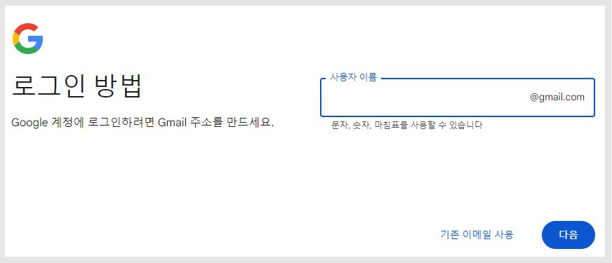

**4) 비밀번호 입력 후 [다음] 선택**

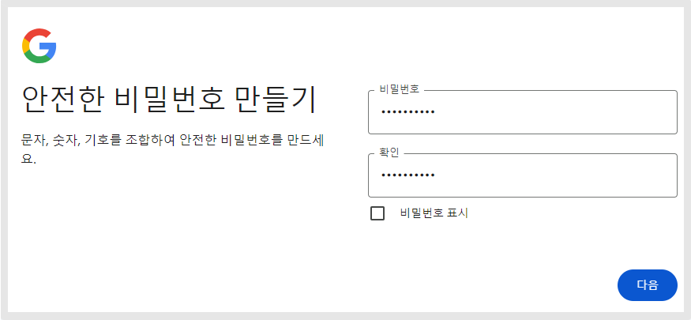

**5) 휴대전화 번호 입력 → 문자 메시지로 인증코드 전송, 6자리 인증번호 입력 후 [다음] 선택**

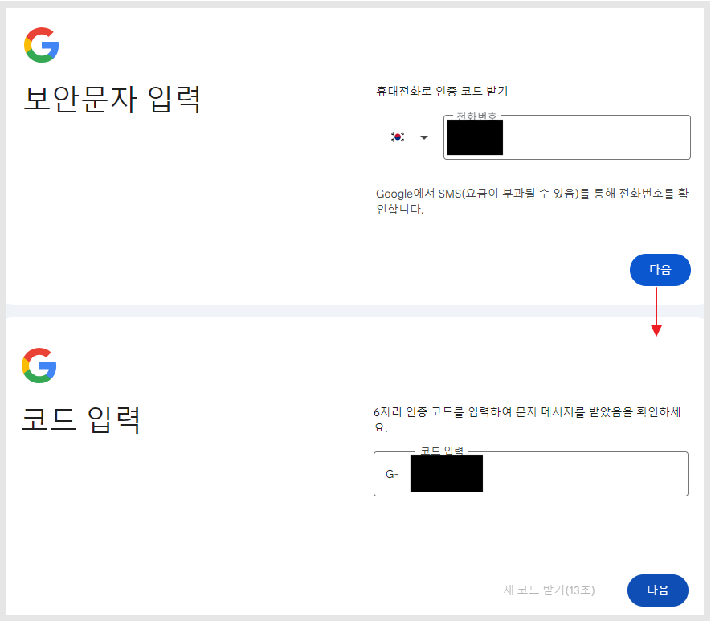

**6) 복구 이메일 주소 입력 후 [다음] 선택**

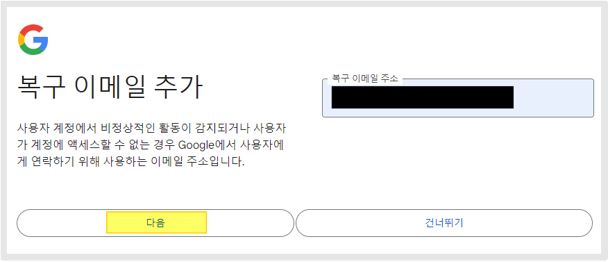

**7) 계정 정보 검토 확인 후 [다음] 선택**

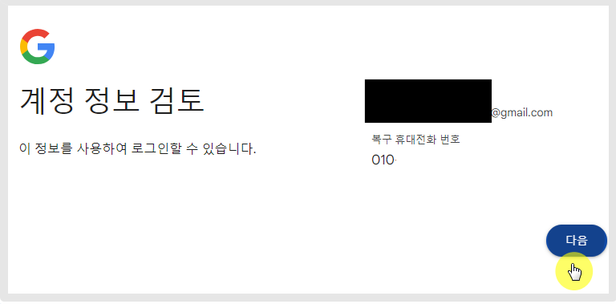

**8) 개인 정보 보호 및 약관 동의 체크 후 [계정 만들기] 선택하면 완료**

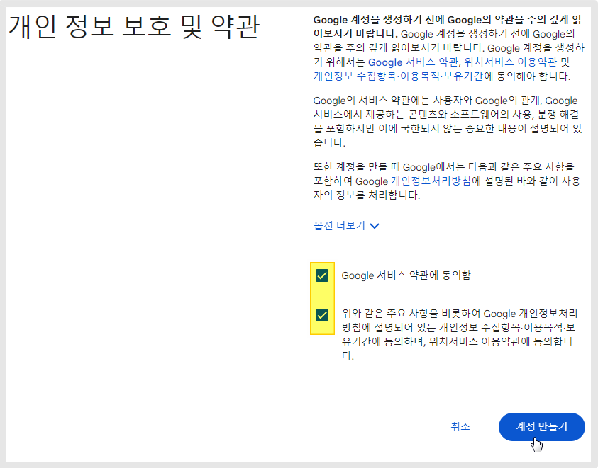

> **주의**: 계정을 처음 만들 때는 '개인용'으로 선택합니다. 개발자 등록 시 다시 '조직 유형: 회사 또는 비즈니스'를 선택하게 됩니다.

---

## STEP 2. Play Console 개발자 계정 만들기

구글 플레이 콘솔: https://play.google.com/console/u/0/developers

### 2-1. 계정유형 선택

기관/단체 - 조직유형 **[회사 또는 비즈니스]** 선택하고 [시작하기] 선택

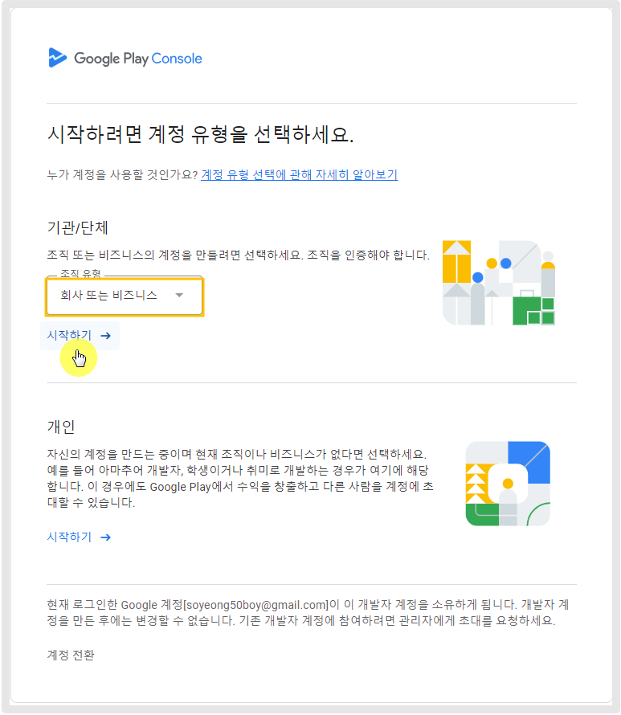

> **개인사업자 주의사항**
> - 개인사업자도 조직 계정으로 등록 가능
> - 유료앱 판매 또는 인앱 판매로 수익을 창출한다면 조직이 아닌 **'개인' 개발자 계정**으로 만들어야 함
> - 개인사업자는 조직으로 수익을 받을 수 없음 (결제프로필 생성 불가)
> - 무료앱만 제출한다면 조직 개발자 계정으로 가입 가능

### 2-2. 정보 입력

조직용 개발자 계정 필요 항목:
- DUNS 번호
- 연락처
- 이메일주소
- 결제수단

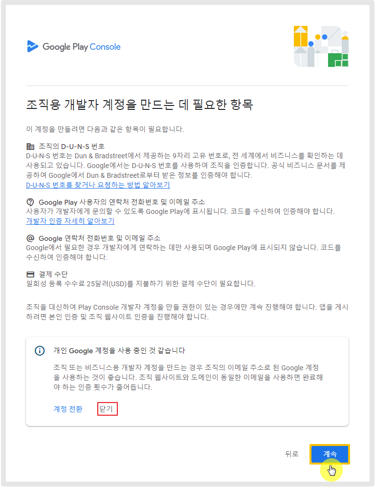

> 개인 구글 계정(gmail) 사용 중일 경우 메시지가 뜰 수 있으며, 회사 이메일이 아닐 경우 진행에 문제 없으므로 [닫기] 버튼 선택

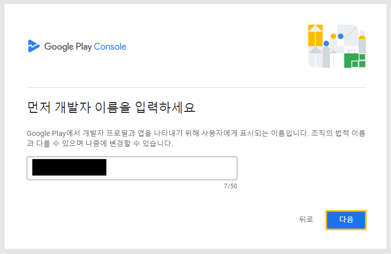

### 2-3. 결제 프로필 연결(등록)

1. **[결제 프로필 만들기 또는 선택]** 버튼 선택
2. '새 결제 프로필 만들기' 체크
3. [계속] 버튼 선택

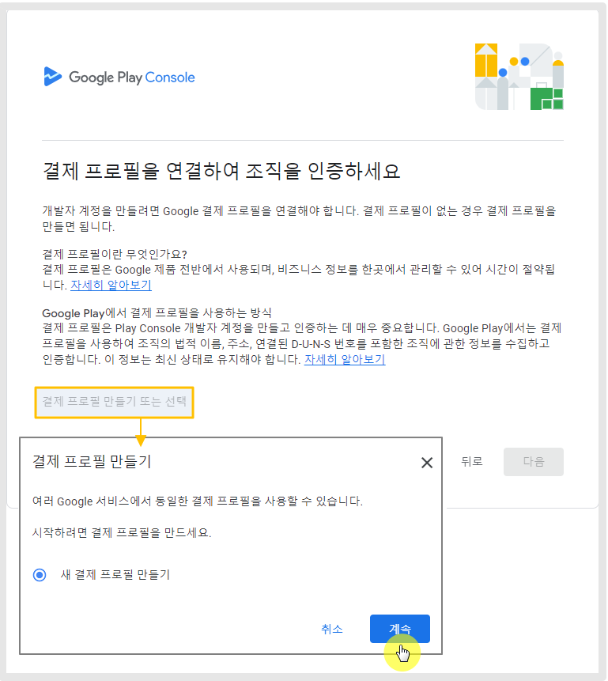

### 2-4. DUNS 번호 입력

1. 발급받은 **DUNS 번호 9자리** 등록
2. [다음] 버튼 선택

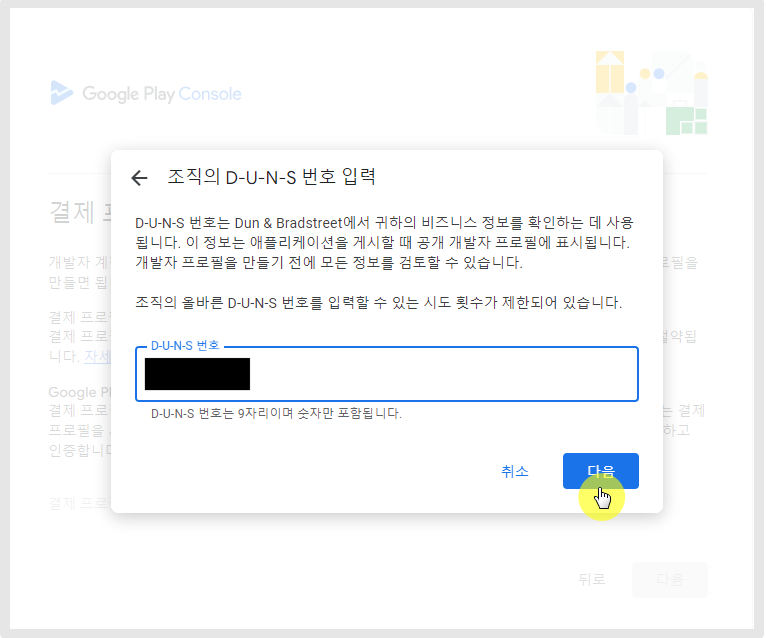

3. DUNS 번호 입력 시 자동으로 번호 발행 시 등록한 주소가 자동 기재됨
4. 세부 주소 등을 수정할 수 있음
5. 모든 내용 입력 후 [확인] 버튼 선택

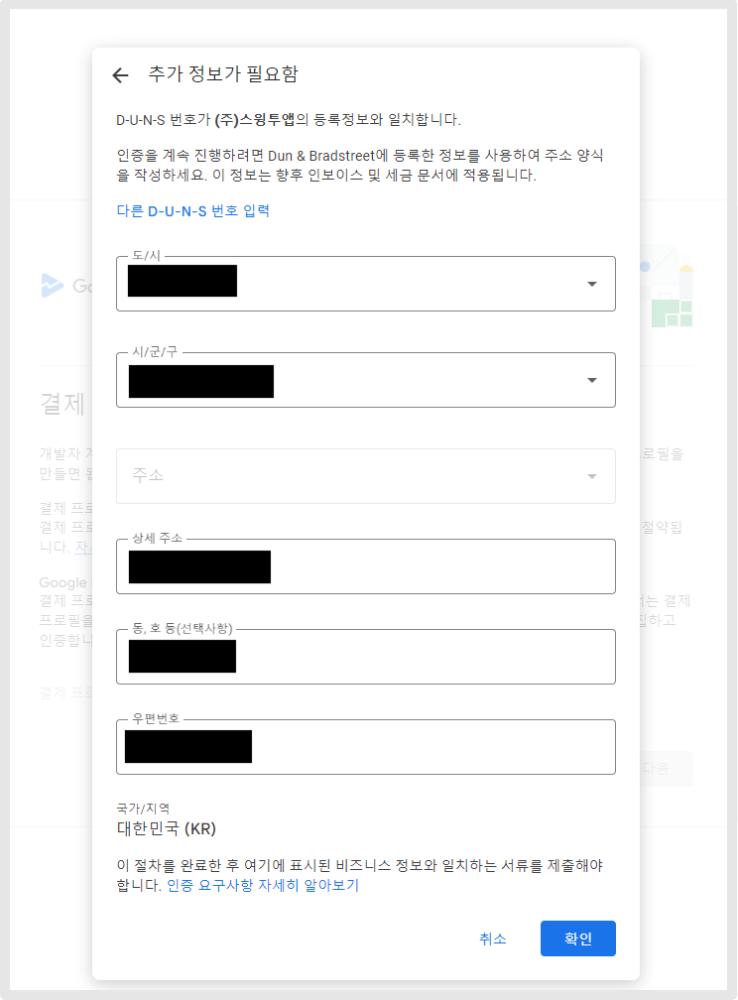

> 결제 프로필 생성 완료 메시지 확인 후 [확인] 버튼 선택

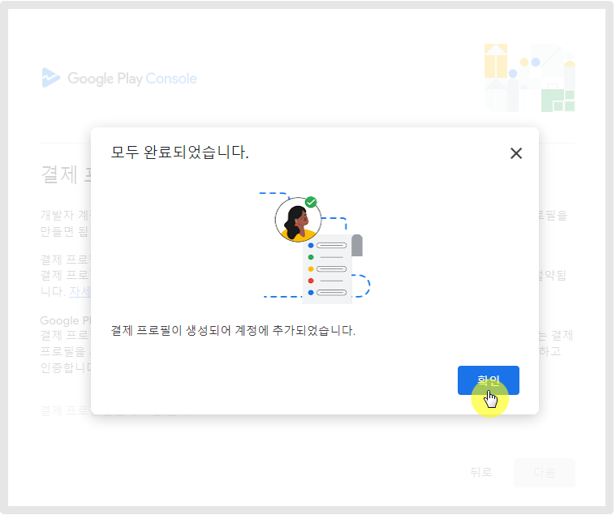

### 2-5. 조직 인증

1. 입력된 정보 확인 후 [다음] 버튼 선택

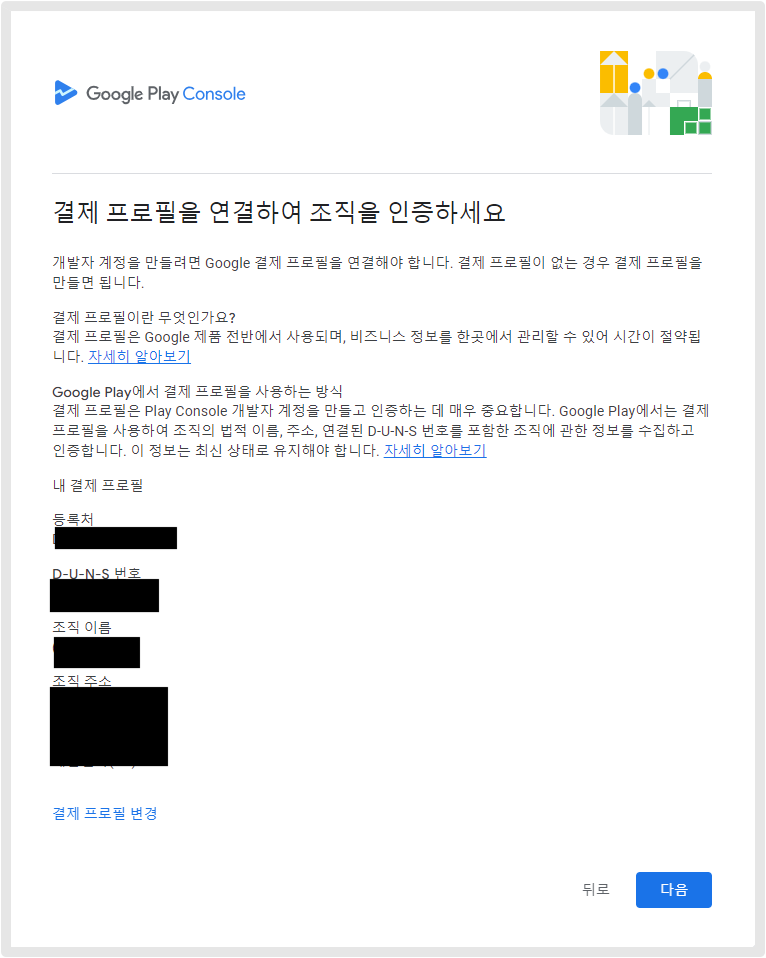

2. **조직 규모**: 선택
3. **조직 전화번호**: 회사 기본 연락처 또는 관리자 개인 핸드폰 번호
   - 국가번호 포함 (예: `+821012345678`)
4. **조직 웹사이트**: 회사 운영 중인 웹사이트 URL 입력 또는 '웹사이트 없음' 체크

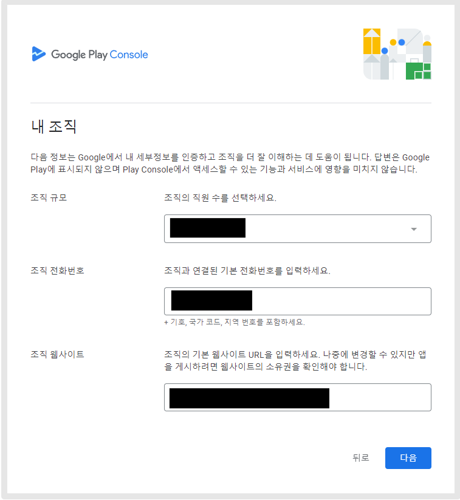

> 해당 정보는 개발자 프로그램 자격요건에 영향을 미치지 않으며, 조직 규모가 작거나 웹사이트가 없어도 개발자 계정 생성에 영향을 주지 않음

계속해서:

1. **개발자 전화번호** 입력 (국가번호 포함, 입력한 번호로 인증번호 전송됨)
2. **개발자 이메일주소** 입력 (입력한 메일로 인증번호 전송됨)
3. 동의 체크
4. [다음] 버튼 선택

### 2-6. 플레이콘솔 이용 정보

- 플레이 콘솔 사용 및 안드로이드 앱개발 경험 여부 기재
- 경험이 없다면 그렇게 기재
- [다음] 버튼 선택

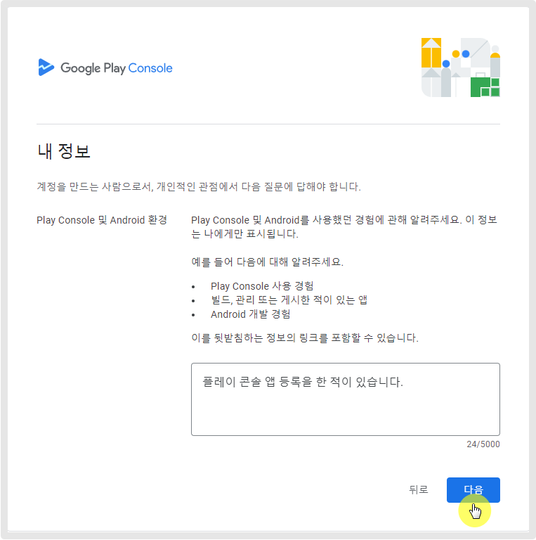

### 2-7. 앱 정보

1. **앱 수 체크**: 앞으로 구글 플레이에 몇 개 앱을 게시할지 선택
2. **Google Play에서 수익 창출**: 앱으로 수익 창출 계획 여부 선택
3. **앱 카테고리**: 특별한 경우 아니면 '해당 사항 없음' 체크
4. [다음] 선택

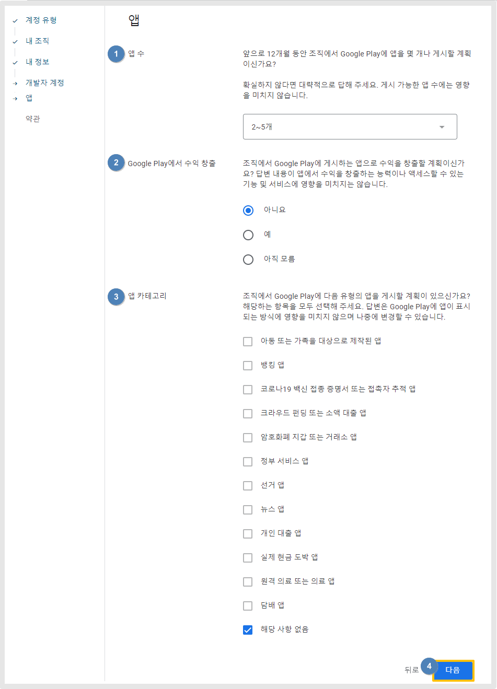

### 2-8. 구글에서 연락하는 방법

1. **담당자 이름** 입력
2. **연락처 이메일주소** (앞서 등록한 이메일과 동일하게 입력 시 추가 인증 없이 확인 완료)
3. **선호 언어**: 한국어 선택 (또는 국가에 맞게)
4. **연락처 전화번호** (앞서 등록한 번호와 동일 시 추가 인증 없이 확인 완료)
5. [다음] 버튼 선택

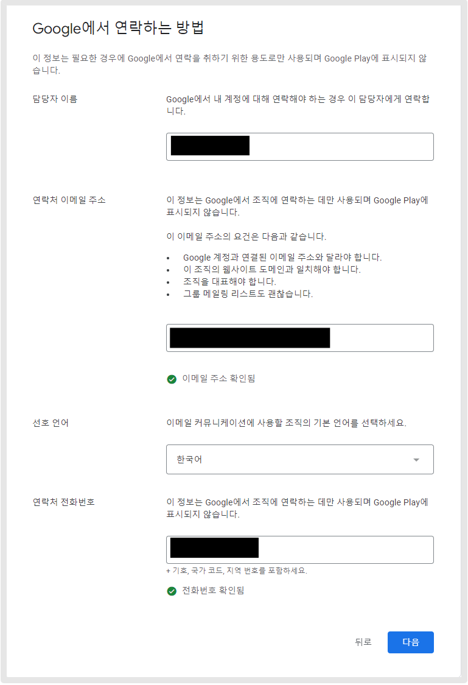

### 2-9. 약관

- 약관 내용 체크
- **[계정 생성 및 결제]** 선택

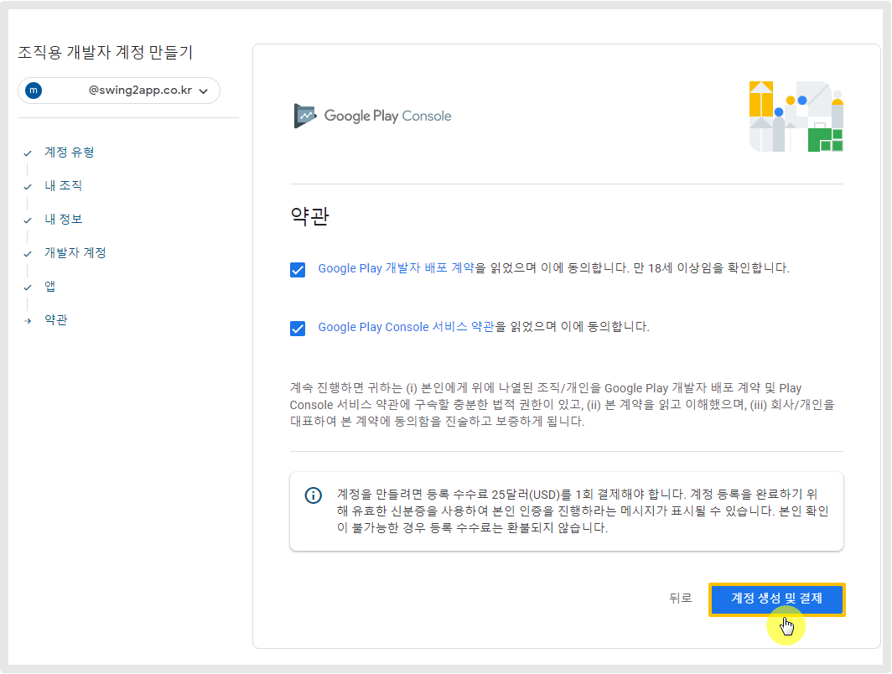

---

## STEP 3. 결제하기 (계정 등록비 결제)

**[신용카드 또는 체크카드 추가]** 선택

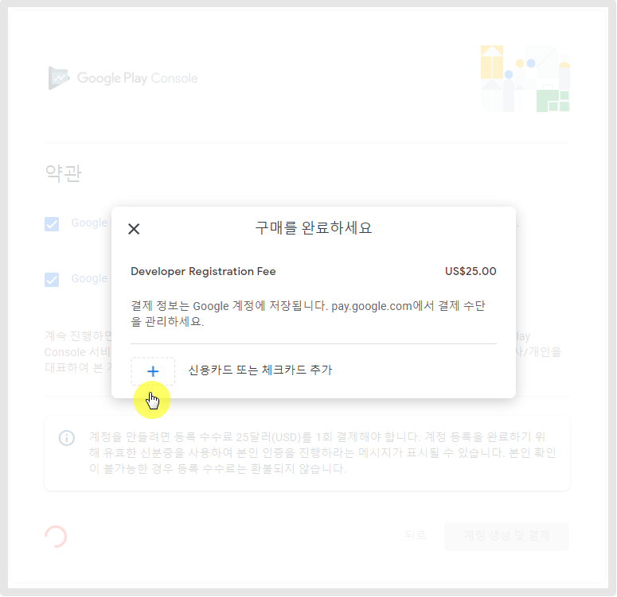

### 결제 정보

- 구글 개발자 등록비: **$25** (한화 약 33,000~37,000원)
- 카드만 결제 가능
- 카드 결제 시 계정 등록자와 카드 소유자는 달라도 상관없음

### 카드 등록 단계

1. 카드 번호 입력
2. 유효기간, 보안코드(CVC번호) 입력
3. 카드 소유자 이름
4. 국가/지역 선택
5. 청구지 우편번호 입력
6. [카드 저장] 버튼 선택

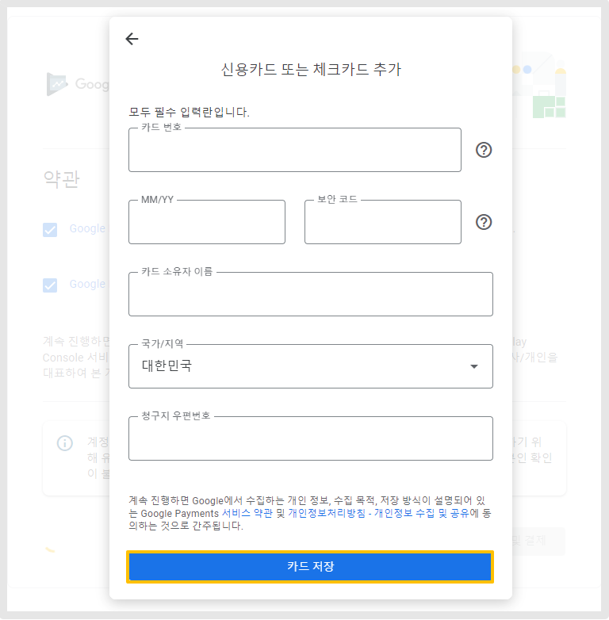

7. **[구입]** 버튼 선택

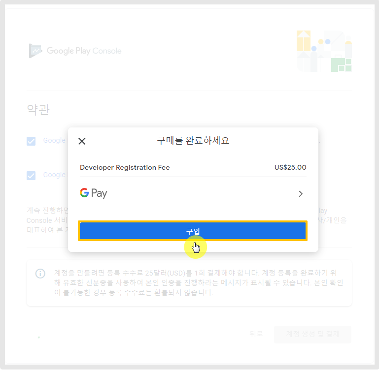

### ⚠️ 국가/지역 일치 필수

> **매우 중요**: 국가/지역은 계정 등록 시 입력한 국가와 **반드시 동일**해야 합니다.
>
> - 예: 계정 등록 시 국가를 '대한민국'으로 입력했으나, 카드 등록 시 국가를 '미국'으로 선택 시 → **본인 인증이 되지 않아 계정 사용 불가**
> - 모든 국가 입력을 통일해야 함
> - 카드 소유자 이름은 다를 수 있으나 **국가는 동일해야 함**
> - 본인인증이 불가하여 실제 사용을 못하게 되며 **환불도 불가능**

### 결과

- 구매 완료 및 개발자 계정 생성 완료

- **중요**: 조직(비즈니스용) 계정은 여기서 끝이 아니라 개발자 계정 설정 **'인증' 작업**을 해야 함

---

## STEP 4. 계정 설정 완료하기 (인증)

계정 등록비 결제 후 **반드시 인증 작업을 완료**해야 앱 등록이 가능합니다.

### 필요한 인증 작업 (3가지)

콘솔 대시보드 상단에 표시되는 인증 항목:

| 순서 | 인증 항목 | 비고 |
|------|----------|------|
| 1 | **본인확인** | 가장 먼저 진행 |
| 2 | **조직 웹사이트 인증** | 본인확인 완료 후 진행 |
| 3 | **전화번호 인증** | 본인확인, 웹사이트 인증 모두 완료 후 진행 |

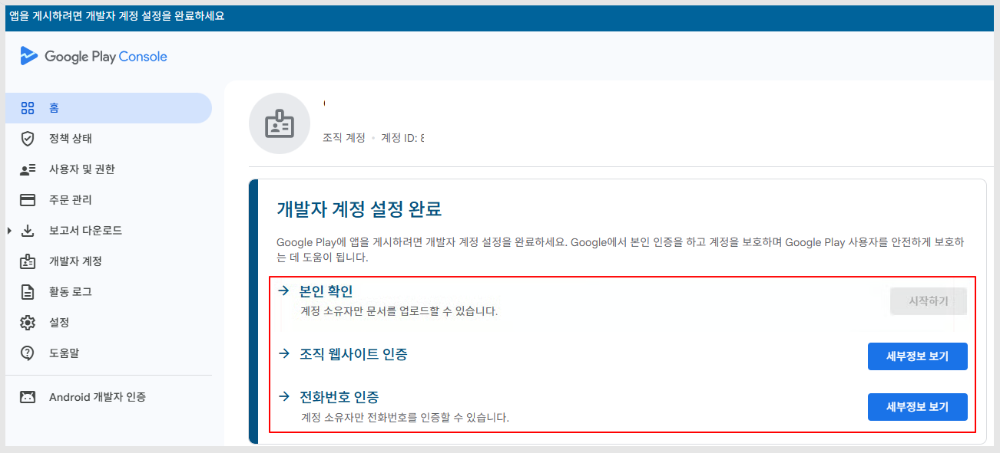

> **인증은 순서대로 진행해야 합니다.** 전화번호 인증은 본인확인, 웹사이트 인증이 모두 완료된 후 진행 가능합니다.

---

## ⚠️ 주의사항 총정리

### 주소지 일치 필수

- 주소지를 구글 개발자 계정 시 입력한 주소지와 **다르게 입력 시 인증이 되지 않을 수 있음**
- 예: 개발자 계정 입력에서는 국가를 '미국'으로, 본인 인증 주소는 '대한민국'으로 입력 시 → 구글에서 본인 인증을 처리하지 않음
- 불법 계정 복제를 막기 위한 정책
- **국가 및 주소는 꼭 동일하게 기재**

---

## 추가 안내사항

1. 플레이스토어 앱 등록 및 출시를 위해서는 구글 개발자 계정이 **필수** (선택이 아닌 필수)
2. 개발자 등록비는 **25달러**이며, 구글 측에 납부하는 수수료로 **한번 결제 시 평생 이용** 가능
3. 구글 개발자 등록비는 스윙투앱 서비스와는 관련이 없으며, 환불 등의 내용은 구글 고객센터로 문의
4. 구글 개발자 '조직' 계정은 스윙투앱으로 대행 작업 요청 가능 (개인 계정은 불가, 작업비용 있음)
5. 스윙투앱으로 제작한 앱을 플레이스토어 출시 시 유료버전앱만 출시 가능 (무료버전은 상용화 불가)
6. 앱 업로드 대행 가능 (플레이스토어 업로드 신청방법 참고)
7. 만든 개발자 계정에는 **제한없이 앱 등록 가능** (정책 위반 시 앱 삭제 및 계정 삭제 가능)
