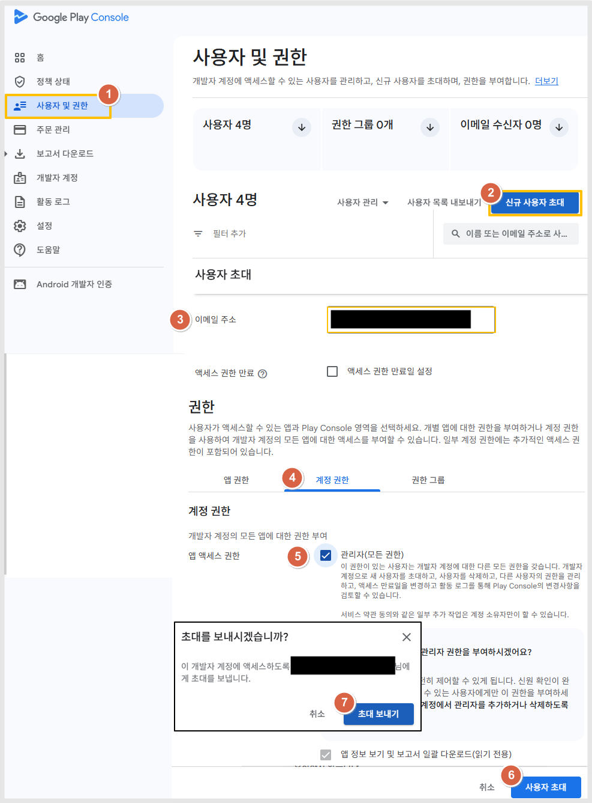
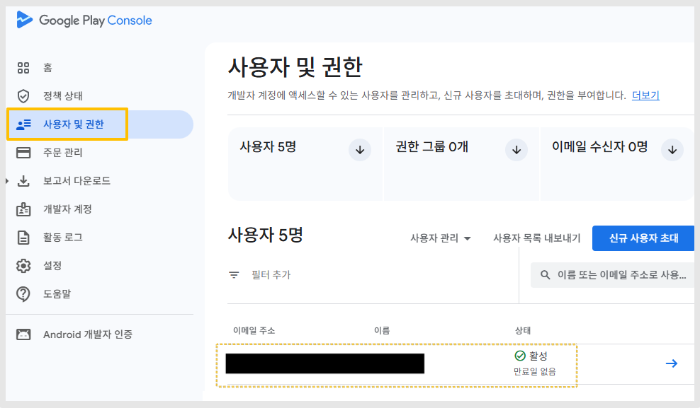

# 구글 플레이 콘솔 사용자 초대 방법

구글 개발자 계정 등록 후, 구글 플레이 콘솔에서 다른 사용자를 초대하는 방법 안내입니다.

---

## 사전 준비

- 구글 개발자 계정이 등록되어 있어야 합니다.
- 개발자 계정 등록비: 25달러 (한번 구매 시 평생 이용)

> **참고**: 개발자 계정이 없다면 먼저 [구글 플레이 콘솔](https://play.google.com/console/developers)에서 계정을 등록해주세요.

---

## 사용자 초대 절차

구글 개발자 계정 등록이 완료되면 [구글 플레이 콘솔](https://play.google.com/console/developers)에서 아래 방법으로 계정 초대를 진행합니다.

1. 왼쪽 카테고리에서 **[사용자 및 권한]** 선택
2. 화면 오른쪽 **[신규 사용자 초대]** 선택
3. **이메일주소**: 초대할 대상 계정 이메일 입력
4. **권한**: 계정 권한 선택
5. **앱 액세스 권한**: '관리자' 체크
6. **[사용자 초대]** 선택
7. **[초대 보내기]** 선택 시 완료

---

## 초대 완료 확인

초대 대상 계정을 입력하고 초대장을 보내면, 초대받은 사용자가 메일을 확인하고 초대를 수락하게 됩니다.

**[사용자 및 권한]** 메뉴에서 등록된 계정을 확인할 수 있습니다.

> **참고**: 초대가 수락되면 해당 사용자는 부여된 권한 범위 내에서 앱 등록 및 관리 작업을 진행할 수 있습니다.
